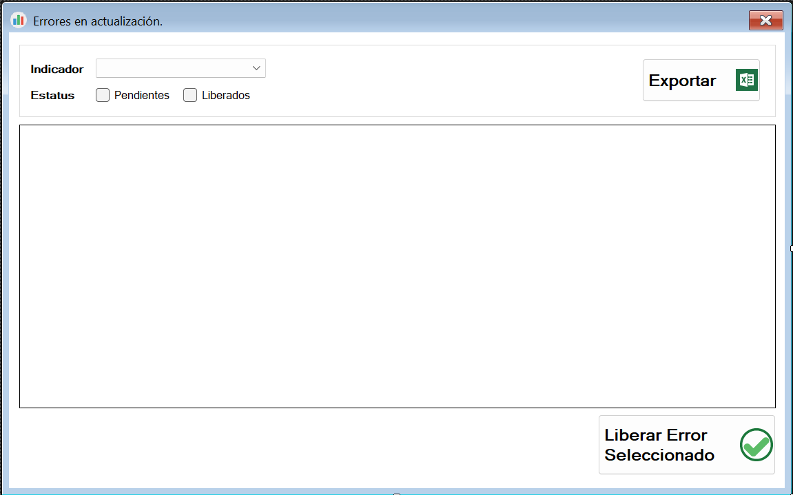

# 📦 SICAP Updater (Automated Data Synchronization Service) V1-APRIL-28

## 🧭 Overview
**SICAP Updater** is a Windows application developed in C# to automatically synchronize operational data from the **SICAP** to **SICAP Web** and **SICAP Indicadores**.

Its mission is to ensure KPIs, project tracking, and contract progress reporting are always up-to-date for directors, managers, administrative and technical staff, without manual intervention.

### Updates screen

### Error log

---

## 💡 Idea & Concept
- Automate the data refresh between operational (WinApp) and reporting (Web/Indicators) systems.
- Replace manual refresh tasks with a reliable and secure background service.
- Provide instant or scheduled updates to guarantee daily operational accuracy.

---

## ✨ Features & Functionality
- **Automated Scheduled Updates**:
  - Background service automatically updating KPIs and summary tables daily.
  
- **Manual Update Trigger**:
  - Manual update button available for urgent refresh needs.

- **Error Handling & Logging**:
  - Error capture with full detail (function, module, user, timestamp, exception message).
  - Logs saved for later troubleshooting and analysis.

- **System Tray Application**:
  - Runs quietly in the background.
  - Notification alerts in case of success, errors, or interruptions.

- **Secure Environment Selection**:
  - DEV, QAS, or PRD database environment selectable from the login interface.

- **Single Instance Enforcement**:
  - Ensures only one active instance runs on the system at any time.

- **Startup Integration**:
  - Configured to auto-launch on system startup ensuring 24/7 availability.

---

## ⚙️ Tech Stack
- **Frontend**: Windows Forms (System Tray App)
- **Language**: C# (.NET Framework)
- **Database**: Microsoft SQL Server
- **IDE**: Visual Studio
- **Scheduling**: Windows Task Scheduler

---

## 🏗 Architecture & Design
- Scheduled data fetch and synchronization with minimal system footprint.
- Layered approach separating UI, business logic, and database access.
- Optimized stored procedures for quick synchronization cycles.
- Encrypted connection strings and secure database access.

---

## 🚀 Deployment & Hosting
- Installed on key internal servers with administrative permissions.
- Automated execution through Windows Task Scheduler during low traffic hours.

---

## 🧑‍💻 My Role & Contributions
- Full system design and development.
- Database optimization for rapid summary table updates.
- UI/UX simplification for manual triggers.
- Security enhancement for safe synchronization operations.

---

## 🧗 Challenges & Learnings
- Building a truly resilient and silent background service.
- Managing synchronization across development, QA, and production environments without collision.
- Ensuring error handling and recovery processes minimized operational risks.

---

## 📈 Future Enhancements
- Convert into a Windows Service instead of a user-launched app.
- Add monitoring dashboards for real-time update tracking.
- Automatic recovery and retry system for failed updates.

---

## 🤝 Project Type
Internal mission-critical tool for the **AHMSA** organization.

---

## 🪪 License
⚠️ Internal Use Only — Copyright reserved to AHMSA.